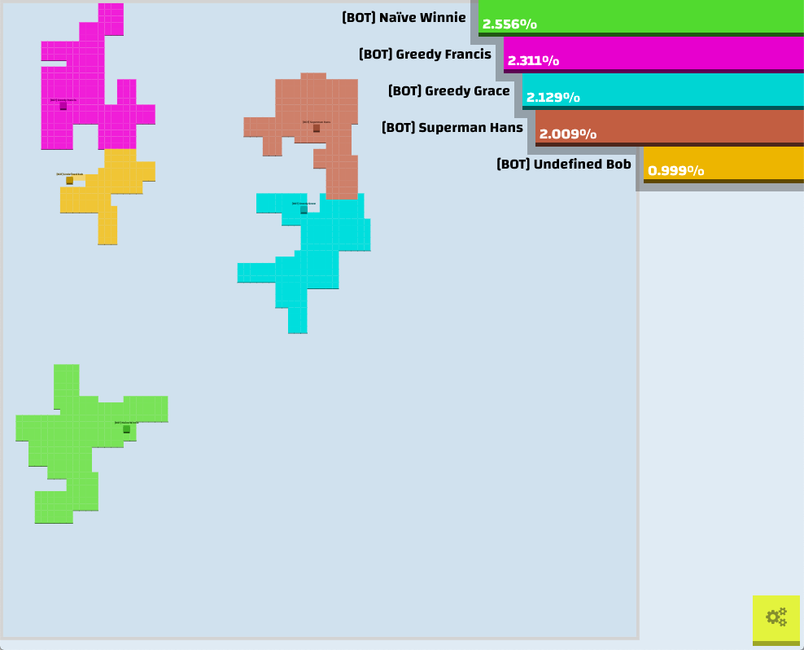

# P2P.IO

This is a version of the game Paper.IO that takes advantage of a Merkle DAG to maintain game state between peers.



## Install

```bash
# Clone this repository and its submodule
git clone https://github.com/johnnyrockett/P2PIO.git --recurse-submodules
# Go into the repository
cd p2pIO
# Install dependencies
npm install
```

Also install tools relating to the Rust language like cargo.

```bash
curl --tlsv1.2 -sSf https://sh.rustup.rs | sh
```

When prompted, enter "2" to customize the installation.
When prompted for "Default toolchain?", enter "nightly". Press enter for all other prompts.

To configure your current shell, run the command below.

```bash
source $HOME/.cargo/env
```

## Usage

```bash
cd contract
cargo install wasm-pack
cd ../rustdag/cli
cargo run server -p 8090 -a 0.0.0.0
```

*new terminal*

```bash
cd rustdag/cli
cargo run key generate contract.key
cargo run -- -s=http://localhost:8090/ deploy contract.key ../../contract/pkg/p2pio_contract_bg.wasm
```

Copy the "Contract ID" returned by this command. In config.json, change the contractID field to this value.

*new terminal*

```bash
npm run build && npm start
```

Going to the printed url should launch the client. Confirmed working on Firefox.

To add other machines as peers, all peers must run the command below for all other peers.

```bash
cargo run -- add-peer --url "{peer's ip}:8090"
```

## Bots

1. Set `bots` in `config.json` to a non-zero value
2. Modify webpack.config.js to use ./paper-io-bot.js as the entry point instead of ./client.js
3. Modify server.js to use your system's path to Firefox. The current path listed should be valid for MacOS.
4. Create firefox profiles named "BOT0" through "BOTN" where n is the max number of bots that your server is simulating. You can do this using the command:

```bash
firefox -ProfileManager
```

5. Repeat the usage steps above but add another machine as a peer using the following command

```bash
cargo run -- add-peer --url "{peer's ip}:8090"
```

The peer machine should also add you as a peer in this scenario.

Your machine will now act as a bot server simulating the number of bots specified playing the game. Any other machine connected as a peer will be able to play with the bots.
